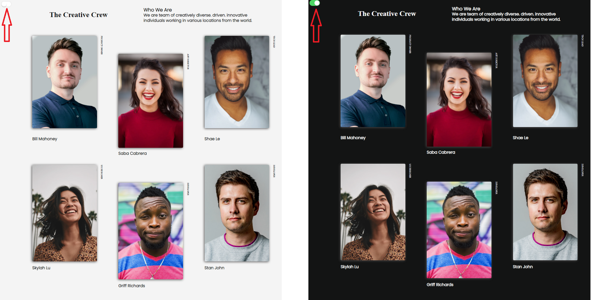
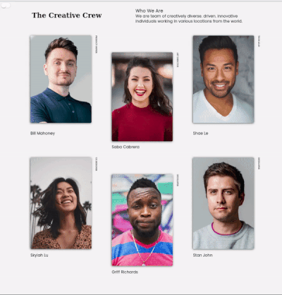

<p>Clarusway</p>

# Project-007 : Team Members Page (HC-007)

## Description
Project aims to create your development team web page.

## Problem Statement

- Your company is updating its website. They ask you to make your development team page.

## Project Skeleton 

```
007-team-members-page(folder)
|
|----readme.md         # Given to the students (Definition of the project)
|----/images # Contains development team members photos         
|----solution
        |----index.html  
        |----style.css   
        |----app.js
```

## Expected Outcome



## Objective

Build a responsive web page similar to [Project 007 Snapshot](Project_007_.png)
Add a theme button to switch your page theme day or night.

- 

### At the end of the project, following topics are to be covered;

- HTML 

- CSS

- JS


### At the end of the project, students will be able to;

- improve coding skills within HTML & CSS & JS

- use git commands (push, pull, commit, add etc.) and Github as Version Control System.

## Steps to Solution
  
- Step 1: Download or clone project repo on Github 

- Step 2: Create project folder for local public repo on your pc

- Step 3: Team Members Web Page

>Part-1 HTML Structure

	- Creat structure of the HTML5
	- Give name of your project (title)
	- Create the main structur of the HTML

>>Part-2 CSS Structure

    - You can apply all the technologies you learn. (Sass, Flexbox, Grid, Bootstrap)
	- Set a background and define font color
	- Set container background color and margin
	- Define others color-size-padding etc...

>>>Part-3 JS Structure

	- Create code for day / night theme switch
	
- Step 4: Push your application into your own public repo on Github

- Step 5: Deploy your application on Github template to showcase your app within your team.

## Notes

- Pay attention to the direction of the texts in the picture.
- Your page should be responsive web.

<center> ⌛ Happy Coding  ✍ </center>

