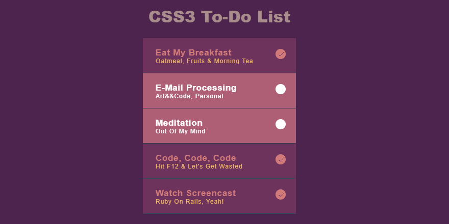
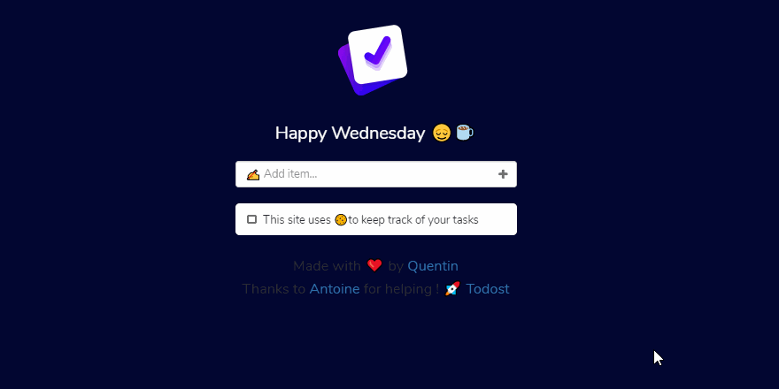
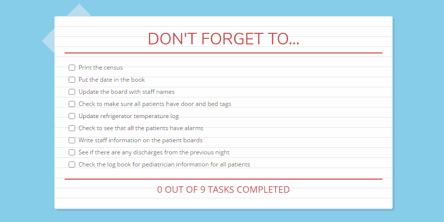

<p>Clarusway</p>

# Project-002 : To-Do App (JS-02)

## Description
Project aims to create a simple To-Do App.

## Problem Statement

- Your company has recently started on a project that aims to create a simple To-Do App. So you and your colleagues have started to work on the project.
- User should create, delete  and mark tasks as them done or undone

## Project Skeleton 

```
002-To-Do App (folder)
|
|----readme.md         # Given to the students (Definition of the project)          
|----solution
        |----index.html  
        |----style.css   
        |----index.js
```

## Expected Outcome






## Objective

Make a To-Do App as in the sample designs.

### At the end of the project, following topics are to be covered;

- HTML 

- CSS

- JS


### At the end of the project, students will be able to;

- improve coding skills within HTML & CSS & JS

- use git commands (push, pull, commit, add etc.) and Github as Version Control System.

## Steps to Solution
  
- Step 1: Download or clone project repo on Github 

- Step 2: Create project folder for local public repo on your pc

- Step 3: Create JS code for To-Do App 

>>Part-1 HTML Structure

	- Creat structure of the HTML5
	- Give name of your project (title)
	- Create the main structur of the HTML

>>Part-2 CSS Structure

	- Set a background
	- Set container background color and margin
	- Define others color-size-padding etc...

>Part-3 JS Structure

	- Create code for To-Do App : User should create, delete  and mark tasks as them done or undone
	
- Step 4: Push your application into your own public repo on Github

- Step 5: Deploy your application on Github template to showcase your app within your team.


<center> ⌛ Happy Coding  ✍ </center>

