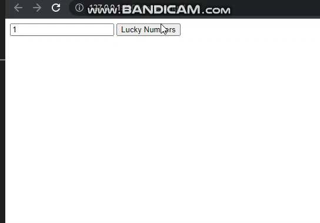

<p>Clarusway</p>

# Project-004 : Lottery Game (JS-04)

## Description
Project aims to create a calculator.

## Problem Statement

- Your company has recently started on a project that aims to create a code to prepare a ticket for a lottery game. So you and your colleagues have started to work on the project.

## Project Skeleton 

```
004-Lottery Game(folder)
|
|----readme.md         # Given to the students (Definition of the project)          
|----solution
        |----index.html  
        |----style.css   
        |----index.js
        |----/img (folder)
```

## Expected Outcome



## Objective

The lottery starts by choosing 6 numbers from 1 to 90 numbers. 1 joker number and 1 superstar number are determined.<br>

- Get from the user how many results will be produced. (max. 8)
- The first 6 digits will be in ascending order when displaying the results.
- The 7th digit is the joker number. it cannot be the same as the first 6 digits.
- The 8th digit is the superstar number. It can be any number from 1 to 90.
- Display the results in HTML. (The visual is entirely up to you.) 

### At the end of the project, following topics are to be covered;

- HTML 

- CSS

- JS


### At the end of the project, students will be able to;

- improve coding skills within HTML & CSS & JS

- use git commands (push, pull, commit, add etc.) and Github as Version Control System.

## Steps to Solution

- Step 1: Download or clone project repo on Github 

- Step 2: Create project folder for local public repo on your pc

- Step 3: Lottery Game page

>>Part-1 HTML Structure

	- Creat structure of the HTML5
	- Give name of your project (title)
	- Create the main structur of the HTML

>>Part-2 CSS Structure

	- Set a background
	- Set container background color and margin
	- Define others color-size-padding etc...

>Part-3 JS Structure

	- Create code for Lottery Game

- Step 4: Push your application into your own public repo on Github

- Step 5: Deploy your application on Github template to showcase your app within your team.


<center> ⌛ Happy Coding  ✍ </center>
