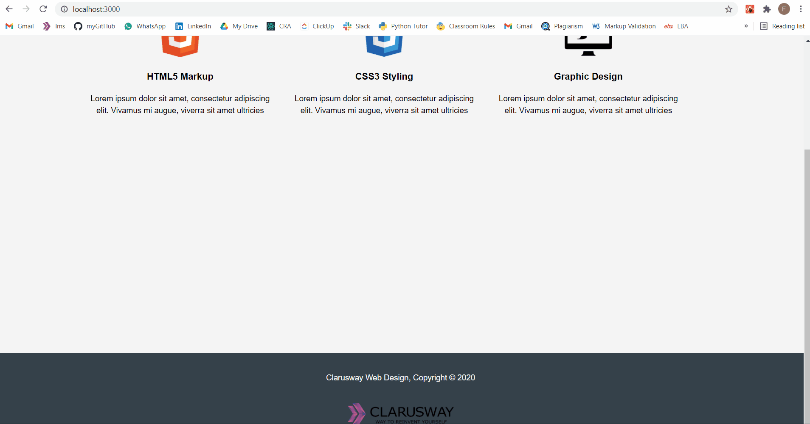

<p>Clarusway</p>

# Project-009 : Clarusway Web Page with Router (RP-09)

## Description

Project aims to create a Clarusway Web Page with Router.

## Problem Statement

- We are adding a new project to our portfolios. So you and your colleagues have started to work on the project.

## Project Skeleton

```
009 - Clarusway Web Page with Router (folder)
|
|----readme.md         # Given to the students (Definition of the project)
SOLUTION
├── public
│     └── index.html
├── src
│    ├── assets.js
│    │     └── images
│    ├── components
│    │     ├── Footer.js
│    │     ├── Card.js
│    │     └── Navbar.js
│    ├── pages
│    │     ├── Home.js
│    │     ├── About.js
│    │     ├── Services.js
│    │     ├── Html.js
│    │     ├── Css.js
│    │     └── Logo.js
│    ├── router
│    │     └── AppRouter.js│       
│    ├── App.js
│    ├── App.css
│    ├── index.js
│    └── index.css
├── package.json
└── yarn.lock
```

## Expected Outcome



## Objective

Build a Clarusway Web Page using ReactJS, react-router and useHistory.

### At the end of the project, following topics are to be covered;

- HTML

- CSS

- JS

- ReactJS

### At the end of the project, students will be able to;

- Improve coding skills within HTML & CSS & JS & ReactJS.

- Use git commands (push, pull, commit, add etc.) and Github as Version Control System.

## Steps to Solution

- Step 1: Create React App using `npx create-react-app clarusway-web-page-with-router`.

- Step 2: Build Clarusway Web Page using ReactJS, react-router and useHistory.

- Step 3: Push your application into your own public repo on Github.

- Step 4: Add project gif to your project and README.md file.

## Notes

- You can add additional functionalities and design to your app.

[images folder](./img/)

**<p align="center">&#9786; Happy Coding &#9997;</p>**
